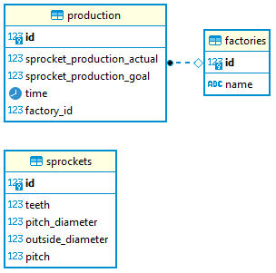

# Sprocket Factory Challenge

## Description
A simple REST API that allows reading and writing of data for a hypothetical small sprocket factory.

It has three entities: Sprockets, Factories, and Production.

Sprockets have descriptions of all the different types of sprockets. Factories have names. Production has a factory ID and records of the sprockets produced in that factory, the sprocket production goal, and the date of production.



## Endpoints

A limited number of endpoints are available. They are as follows:

`GET /sprocketFactory/v1/production`

Returns a list of all the production records for all the factories.

`GET /sprocketFactory/v1/production/{id}`

Returns a list of all the production records for the specified factory id.

`GET /sprocketFactory/v1/sprockets`

Returns a list of all the sprockets in the database.

`GET /sprocketFactory/v1/sprockets/{id}`

Returns the sprocket with the specified id.

`POST /sprocketFactory/v1/sprockets`

Creates a new sprocket.

`PUT /sprocketFactory/v1/sprockets/{id}`

Updates the sprocket with the specified id.

## Requirements
- python 3.10
- pip

Optional:
- virtualenv
- docker for DB

## Installation
1. Clone the repository
1. (Optional) Create and activate a virtual environment
    ```
    python -m venv .venv
    In Linux: source .venv/bin/activate 
    In Windows: .venv\Scripts\activate.bat
    ```
1. Install the requirements
    ```
    pip install -r requirements.txt
    ```
1. (Optional) Start the database. Is a docker container with postgresql
    ```
    docker-compose up -d
    ```
1. (Optional) Populate the database with some testing data
    ```
    python populate_db.py
    ```
1. Configure the .env file to change the database connection parameters. By default it uses the docker container, but change it to your needs.
    ```
    cp .env.example .env
    ```
1. Finally, start the application
    ```
    python run.py
    ```

## Testing
The application has a few tests. To run them, simply execute the following command:
```
python -m pytest
```

To run the tests with coverage, execute the following command:
```
python -m pytest --cov
```


## FAQ
### Why Flask?
I selected Flask as the framework for this project because of its lightweight and flexible nature, which makes it easy to use and deploy. Furthermore, its easy-to-use debugging tools are a major advantage. Unlike some other frameworks, Flask does not have an integrated ORM, which I view as a positive feature, as it allows you to choose the ORM that best fits your needs. In my case, I chose to use SQLAlchemy. Although it is possible to develop a project without an ORM, this is generally not advisable for real projects.

Flask's decorator-based routing system and easy json response is another aspect that I appreciate, as it is simple to use and allows for the creation of fully flexible REST APIs.

Although Django is a powerful framework, I felt it was overkill for this small project due to its heavy and complex nature. Additionally, its opinionated structure, which is usually a good thing, did not fit the needs of this particular project. While it does have a built-in ORM, it lacks flexibility and is not well-suited for quick deployment on a project of this size. Although Django Rest Framework is a powerful tool for creating REST APIs using django-rest-framework, it is also opinionated and requires more configuration than creating a REST API from scratch in Flask, which is better suited for tiny and quick projects like this.

I know there are other frameworks, such as FastAPI, but in this case I decided to go with Flask because it is a framework that I am more familiar.

### Why three different tables?

Although it was not strictly necessary to have three separate tables, I chose to do so in order to follow good database normalization practices. This approach makes the database more flexible and easier to understand, and it optimizes record and index addition. Upon reviewing the data in the provided JSON file, particularly the production records, I noticed that the timestamps were in integer form and that each factory had three columns. Based on this information, I decided to create three columns in the production table and include a foreign key to the factory table.

While the factory table is not strictly required and its "name" column is not on the original data, I opted to create them anyway. This decision further normalizes the data, making it easier to add new factories, production records, or indexes.

### Is pylint necessary?

Well, it's not strictly necessary, of course, but I like to use it to keep my code clean and consistent, specially when working in a team. As any python programmer knows, _readability counts_ and it's almost mandatory to follow the PEP8 guidelines. However, pylint can be quite strict, and it may be necessary to disable some rules when working with certain frameworks, such as Flask. Although I worked on this project alone and it was a quick project, when working as part of a team, it is important to establish which rules are essential and which can be ignored.

### Where are the microservices?

Considering the limited size and time constraints of this project, I decided that creating a single program was sufficient. However, if this project were to expand in scope, I would recommend creating a microservice for each entity, such as sprocket, factory, and production, as well as one for the endpoint, or maybe another architecture. Using microservices would improve scalability and facilitate maintenance.

Creating such a system would require many things, such as a broker system, a deployer, and  maybe a framework specifically for microsystems. Nevertheless, given the scope of this project, I decided to keep it simple and create a single program.

### Git commits

In this proyect, with no mandatory commit policy, no issue tracker, no backlog, etc... I decided to commit as I go, and to keep the commits as small as possible but significant. This way, it is easier to track the changes and to revert them if necessary. I also tried to keep the commit messages as descriptive as possible. Also, as I write this, I regret that I did not use any branching strategy, I should have used a dev branch, and a branch and merge for every feature. But well, there are so little amount of commits that it is not really a problem hard to solve from now on.

### Testing

I did small tests, only to test all the endpoints. It gives a good coverage, but the test are only happy path, with no error handling. I would like to add more tests, but I ran out of time.

## TODO

Given the limited time and scope of this project, there are many things that could be improved. Some of them are:

- loggers: Log everything, with different levels 
- metrics: metrics to monitor the application (e.g.: prometheus)
- authentication: some standard auth system for the endpoints with different roles
- error handling: better error handling for the things that FLASK does not handle
- RESTFull endpoints for all the entities
- The folder structure can be improved: A single file for each entity, and a folder for the endpoints, etc...
